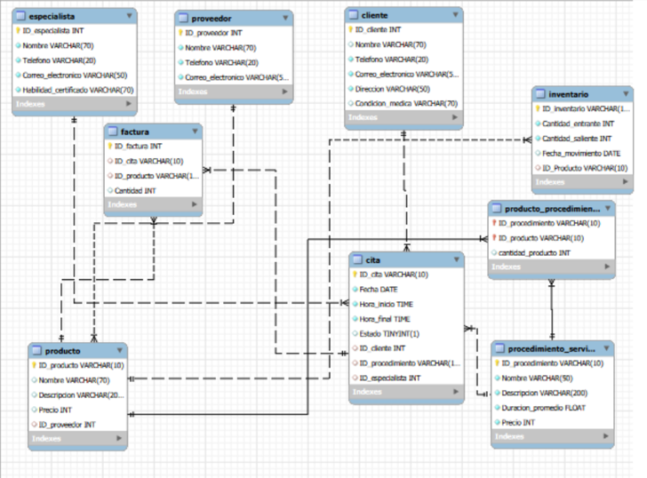

# Centro Estetico - Gestión de Procedimientos, Citas y Productos

Diseño de una base de datos para un Centro Estético Integral que ofrece diversos procedimientos, vende productos y requiere una gestión detallada de citas y personal. 
Clientes: Información básica, historial de visitas, alergias o condiciones médicas relevantes para los tratamientos, y su programa de fidelización. 
Procedimientos y Servicios: Clasificación de los servicios (ej. Faciales, Corporales, Depilación), con detalles como nombre, descripción, duración promedio, precio base, y los materiales/productos requeridos para su ejecución. 
Citas: Gestión de las citas programadas, incluyendo fecha, hora, cliente, procedimiento(s) solicitado(s), el especialista asignado y el estado de la cita (pendiente, completada, cancelada). 
Especialistas/Personal: Información del personal, sus habilidades/certificaciones, y su disponibilidad horaria para la programación de citas. 
Inventario/Productos: Controlar el stock de productos utilizados en los procedimientos y los productos vendidos directamente a los clientes, incluyendo proveedores y movimientos de inventario. 
El diseño debe permitir registrar el detalle del consumo exacto de materiales en cada procedimiento y enlazar la venta de un producto a una cita específica para un seguimiento completo

## Tabla de Contenidos

1. [Presentación del proyecto](#presentación-del-proyecto)
2. [Descripción](#descripción)
3. [Tecnologías Utilizadas](#tecnologías-utilizadas)
4. [Esquema de Base de Datos](#esquema-de-base-de-datos)
5. [Tablero de análisis](#tablero-de-análisis)

---

## Presentación del proyecto

En el siguiente enlace pueden encontrar las diapositivas que muestran el equipo de trabajo y la respectiva información de contacto, el paso a paso realizado, las conslusiones obtenidas y las recomendaciones estrategicas.

> [Slides en Prezi](https://prezi.com/view/J0RtdibZ3S4YmHrSaId3/)

## Descripción

La base de datos ha sido desarrollada para proporcionar la infraestructura de datos esencial para una aplicación de banca digital, permitiendo la gestión eficiente de los clientes, productos financieros, transacciones y cartera. Incluye tablas normalizadas y relaciones para asegurar integridad referencial y optimizar consultas de alto rendimiento.

## Tecnologías Utilizadas

-  - Sistema de gestión de base de datos relacional.
-  - Población de datos y creación de interfaz cliente y administrador.
-  - Herramienta para realizar y gestionar migraciones de bases de datos en Python.

## Esquema de Base de Datos

### Diagrama Relacional

> 

## Tablero de análisis

En el enlace a continuación se podrá visualizar el tablero de análisis creado

> [Análisis de datos BankTech](https://app.powerbi.com/view?r=eyJr
